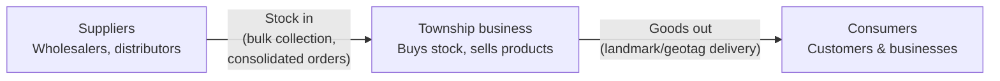
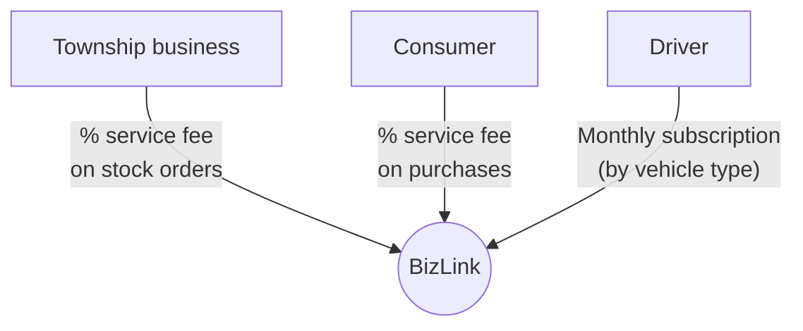

# BizLink

**By Tech Crusaders**

## Background

Townships in Tshwane are full of small businesses selling products and services, but goods move through a scattered ecosystem. Courier and ride-hailing services cost small businesses too much, and without affordable delivery, entrepreneurs cannot reach more customers.

## Problem Statement

- High costs of delivering goods/services
- Delays and unreliable services
- Local businesses do not have online visibility
- Consumers are limited according to area of residence
- Crime affects business reputation and finances

## Proposed Solution

One centralised system connecting businesses to their suppliers and their customers:

- **Suppliers** — provide stock and inputs
- **Township businesses** — stock in (buy stock, sell products), goods out
- **Consumers** — customers and other businesses

### System flow

## Competitors

- **KasiD** — B2B logistics pivot providing stable revenue beyond consumer food delivery; strong brand recognition as a pioneer in the space.
- **Spaza Eats** — building a full-fledged ecosystem for township commerce (delivery, fintech, merchant funding); rebranded to Spaza Market, signalling ambition beyond food delivery.
- **NouNou** — core claim is affordability; a real-world comparison showed the same meal being R45 cheaper than a national competitor, achieved via a lean operational model.
- **MDZ Go** — a pure hyperlocal play, laser-focused on a single township, with strong community trust and technical execution.
- **Delivery Ka Speed** — pivoted to B2B, becoming a last-mile logistics partner for major e-commerce/FMCG companies, securing high-volume stable revenue and rapid profitability.
- **Lupa Township Delivery** — model built entirely on community trust as a security and operational strategy.

## Uniqueness

- **Bulk collection service** — pick up stock from wholesalers, markets, and distributors, and deliver to spazas/shops within the same area.
- **Consolidated orders** — multiple small businesses combine orders (grouped within the same location) to reduce transportation costs.
- **Scheduled restocks** — daily/weekly fixed slots so businesses never run out of stock.
- **Landmark/geotag addressing** — easy navigation for local drivers (e.g. "Next to Boxer, near the big tree" + pin location).

## Commercialization

- **Pay-per-delivery** — a percentage of the service fee goes to BizLink, applied both when a business gets stock from suppliers and when a consumer gets finished goods from the business.
- **Subscription for drivers** — drivers pay a monthly subscription to use the platform, priced by vehicle type.

### Revenue flow

